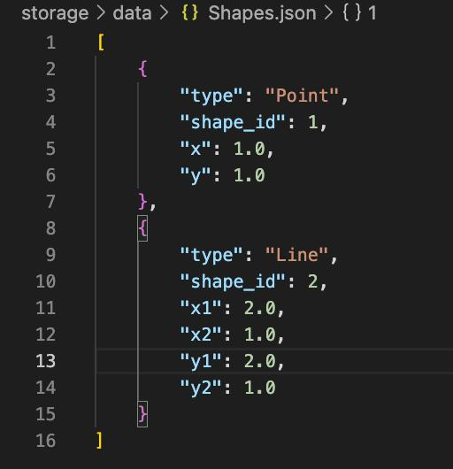

<p align="center">
  
</p>

Тестовое задание для позиции **junior Python Backend Developer** в Neiros.

Программа реализует CLI для работы с геометрическими фигурами:  
Создание, сохранение, отображение и уаделение фигур, а также взаимодествие со сторонними JSON файлами.

---

## 📂 Структура репозитория
```  
├── editor
      ├── editor.py            # 📄 Класс управления фигурами
      └── menu.py              # 📄 Класс меню программы
├── storage/
      ├── data/
            └── Shapes.json    # 📄 Файл для хранения фигур  
      └── json_storage.py      # 📄 Интерфейс фигур             
├── shapes/
      ├── shape.py             # 📄 Интерфейс фигур
      ├── point.py             # 📄 Класс, описывающий точку
      ├── line.py              # 📄 Класс, описывающий линию
      ├── square.py            # 📄 Класс, описывающий квадрат
      ├── rectangle.py         # 📄 Класс, описывающий прямоугольник
      ├── circle.py            # 📄 Класс, описывающий круг
      ├── oval.py              # 📄 Класс, описывающий овал
      └── factory.py           # 📄 Фабрика созданию фигур  
└── main.py                    # 📄 Точка входа в программу  
```
---

### 🚀 Запуск программы

1. Клонировать репозиторий
2. Собрать Docker образ
3. Запустить контейнер
```bash
docker build -t vector-editor .
docker run -it --name vector-cli vector-editor
```

### 🖥 Демонстрация работы

### Меню


### Создание Точки


### Создание Линии


### Создание Квадрата


### Создание Прямоугольника


### Создание Круга


### Создание Овала


### Просмотр списка фигур


### Удаление фигуры


### Удаление всех фигур


### Работа с файлом


### Выбор файла


### Загрузка из файла




