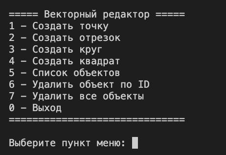
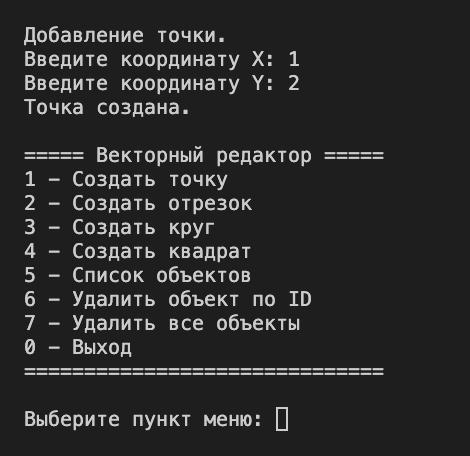
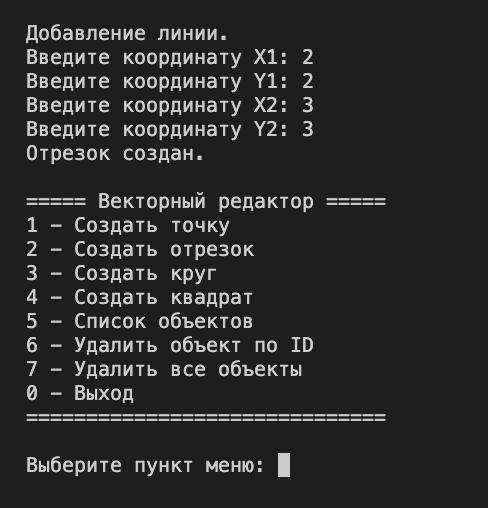
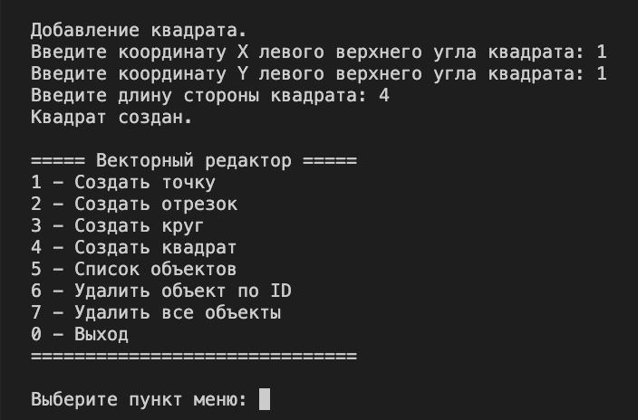
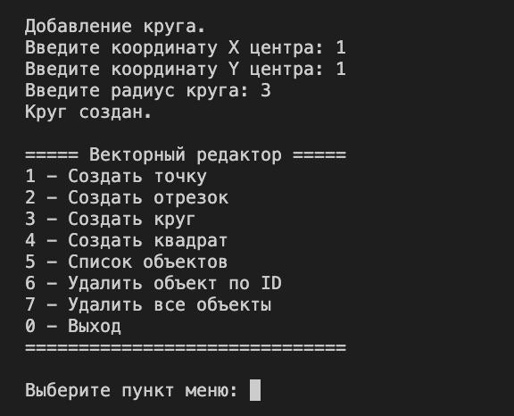
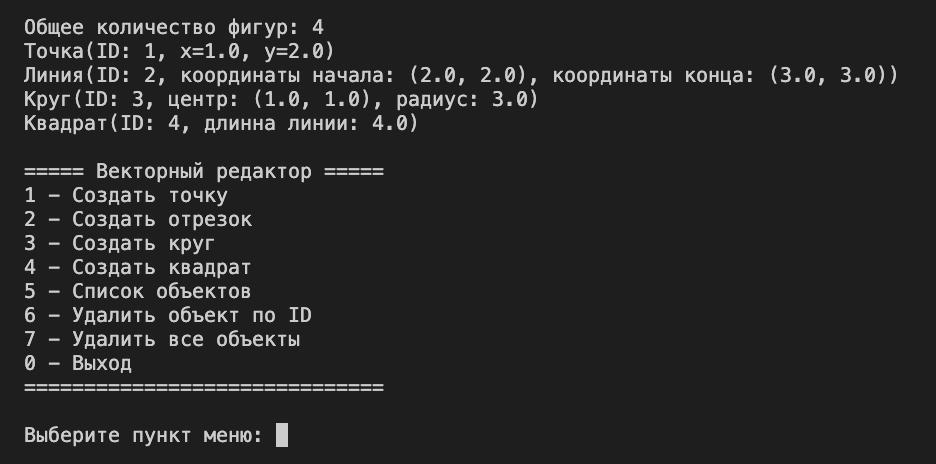
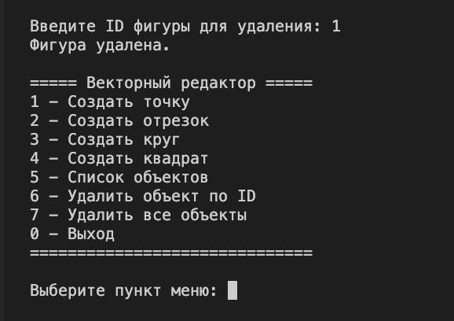
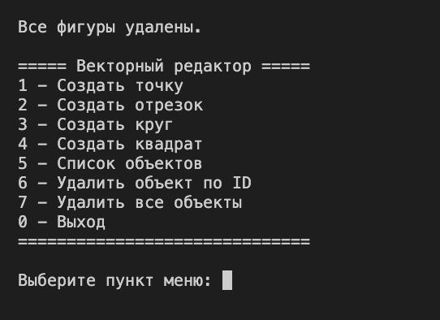

<p align="center">
  
</p>

Тестовое задание для позиции **junior Python Backend Developer** в Neiros.

Программа реализует CLI для работы с геометрическими фигурами:  
Создание, сохранение, отображение и уаделение фигур.

---

## 📂 Структура репозитория
```  
├── editor
      ├── editor.py  # 📄 Класс управления фигурами
      └── menu.py    # 📄 Класс главного меню программы
                
├── shapes/
      ├── shape.py   # 📄 Интерфейс фигур
      ├── point.py   # 📄 Класс, описывающий точку
      ├── line.py    # 📄 Класс, описывающий линию
      ├── square.py  # 📄 Класс, описывающий квадрат
      ├── circle.py  # 📄 Класс, описывающий круг
      └── main.py    # 📄 Фабрика созданию фигур  
└── main.py          # 📄 Фабрика созданию фигур  
```
---

### 🚀 Запуск программы

1. Клонировать репозиторий
2. Собрать Docker образ
3. Запустить контейнер
```bash
docker build -t vector-editor .
docker run -it --name vector-cli vector-editor
```

### 🖥 Демонстрация работы

### Меню


### Создание Точки


### Создание Линии


### Создание Квадрата


### Создание Круга


### Просмотр списка фигур


### Удаление фигуры


### Удаление всех фигур



